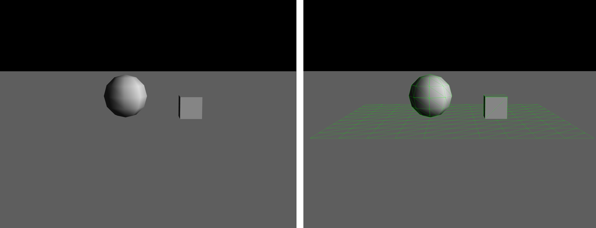

# Debug renderer for Three.js

Making a WebGL app using Cannon.js and Three.js? Feeling like you're feeling your way through the physics darkness? Then you've come to the right place. This tool will visualize your Cannon.js physics objects in your Three.js scene.

## Example usage

To use the tool, you have to do two simple things.

1. Create a ```THREE.CannonDebugRenderer``` instance.
2. Run ```.update()``` in your render loop.

```js
var world = new CANNON.World();
var scene = new THREE.Scene();
var cannonDebugRenderer = new THREE.CannonDebugRenderer( scene, world );

// ...add things to world and scene...

function render() {
    requestAnimationFrame( render );
    world.step( timeStep );            // Update physics
    cannonDebugRenderer.update();      // Update the debug renderer
    renderer.render( scene, camera );  // Render the scene
}
render();
```

## Before vs after

To the left you see a scene with only Three.js objects in it. To the right, the ```THREE.CannonDebugRenderer``` was added, and you can now see that there's a physics box, sphere and plane in the scene.


